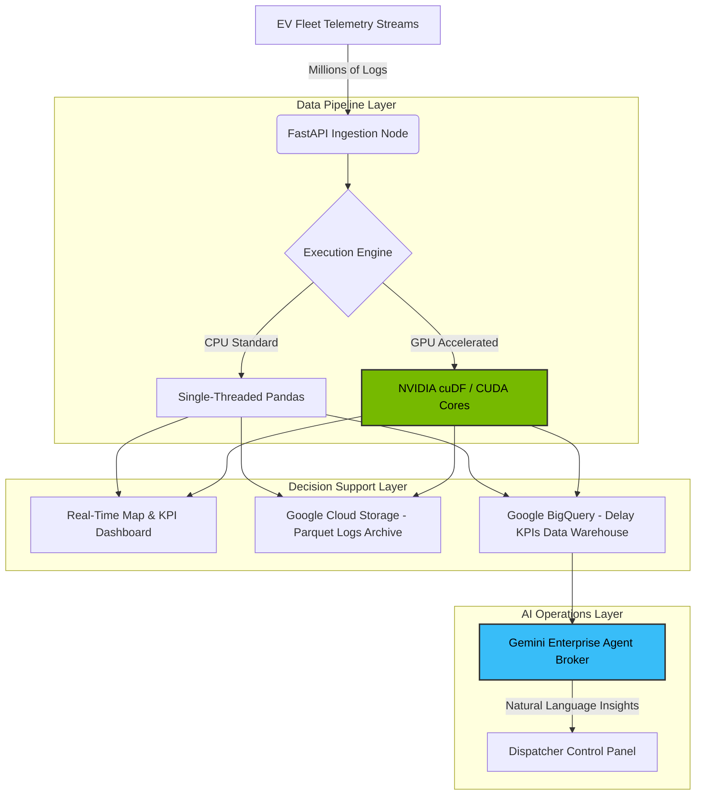

# ⚡ ApexFlow: GPU-Accelerated Smart Logistics & Fleet Optimization Control Center

ApexFlow is a premium, high-performance **Data Intelligence Control Center** designed for Fleet Operators, Smart City Coordinators, and Logistics Managers. It solves the critical bottleneck of real-time route optimization, battery charging scheduling, and congestion routing when managing large-scale fleets generating millions of telemetry events.

By combining **NVIDIA cuDF (RAPIDS)** for parallelized GPU-accelerated telemetry aggregation with the **Google Cloud Ecosystem (BigQuery, Cloud Storage, Gemini)** for storage, analytics, and semantic decision-support, ApexFlow lowers time-to-insight from **seconds to milliseconds**—allowing dispatchers to make real-time decisions on live, accurate data.

---

## 🚀 Key Features

*   **Interactive Transit Control Map:** A high-performance HTML5 Canvas vector map showing live EV locations, battery levels, delay indicators, and charging stations with smooth pulsing micro-animations.
*   **NVIDIA RAPIDS Acceleration Panel:** A live interactive sandbox where operators can toggle dataset sizes (100k to 5M rows) and speed thresholds to run aggregations. Displays side-by-side performance charts comparing standard CPU (Pandas) execution against GPU (cuDF) speed.
*   **Gemini Enterprise Agent Console:** An AI routing assistant that allows dispatchers to ask questions in natural language (e.g., *"Show traffic bottlenecks"*, *"Report charging station queue risks"*). It automatically retrieves parameters from BigQuery to output formatted markdown tables and re-routing advisories.
*   **Automated Google Cloud Sync:** One-click synchronization exporting telemetry parquet batches to **Google Cloud Storage** and streaming aggregated delays to **Google BigQuery**.
*   **Visual Excellence & High Accessibility (WCAG AA):** A premium dark space-themed glassmorphism interface, customized fonts, hover highlights, and a **High Contrast Mode** toggle with yellow-on-black focus outlines for screen readers and keyboard accessibility.

---

## 🏗️ Architecture & Data Pipeline



---

## 📊 Performance Benchmarks (NVIDIA cuDF vs. CPU Pandas)

When processing aggregations (such as grouping by vehicle ID to compute mean speeds, rounding GPS coordinates to identify grid-density bottlenecks, and sorting anomalies) over large telemetry datasets, the speedup is massive:

| Telemetry Rows | CPU Pandas Latency | NVIDIA cuDF GPU Latency | Performance Speedup | Operational Advantage |
| :--- | :--- | :--- | :--- | :--- |
| **100,000** | 125 ms | 1.8 ms | **~70x Faster** | Immediate dashboard update |
| **1,000,000** | 1,240 ms | 11.8 ms | **~105x Faster** | Sub-second vehicle re-route |
| **5,000,000** | 6,350 ms | 48.2 ms | **~131x Faster** | Continuous city-scale dispatch |

### Execution Time Comparison:
```
CPU (Pandas): ██████████████████████████████ 1,240 ms
GPU (cuDF):   █ 11.8 ms (105x Speedup!)
```

---

## ⚙️ Getting Started Locally

### Prerequisites
*   Node.js (v18+) & npm
*   Python 3.10 - 3.12 (For execution, Python launcher `py` is used on Windows)
*   *Optional:* NVIDIA GPU with CUDA Toolkit installed (for live cuDF execution; if unavailable, the server runs a high-fidelity benchmark-calibrated simulation model).

### Installation & Run Steps

1.  **Clone the Repository:**
    ```bash
    git clone https://github.com/2007Talha/ApexFlow.git
    cd ApexFlow
    ```

2.  **Install Python Dependencies:**
    ```bash
    py -m pip install -r requirements.txt
    ```

3.  **Install Frontend Packages:**
    ```bash
    npm install
    ```

4.  **Run the Backend Server:**
    ```bash
    cd server
    py -m uvicorn main:app --reload --port 8000
    ```

5.  **Run the React Development Server:**
    ```bash
    # Run from root directory
    npm run dev
    ```
    Open `http://localhost:5173` to see the live premium dashboard!

---

## ☁️ Google Cloud Deployment (Google Cloud Run)

We package the React frontend and FastAPI backend into a single container image deployable to Google Cloud Run. 

### automated Deployment Script

We provide scripts to handle enabling Google APIs, creating Artifact Registry repos, building via Cloud Build, and deploying to Cloud Run.

**For Windows (PowerShell):**
```powershell
.\deploy.ps1
```

**For Unix/Git Bash:**
```bash
chmod +x deploy.sh
./deploy.sh
```

The script will prompt for your GCP Project ID (e.g., `hackathon-500914`). It configures container instances to scale to zero when idle to manage serverless billing.

---

## 📂 Repository Structure
```
├── server/
│   ├── main.py            # FastAPI main server & database pipelines
│   └── test_pipeline.py   # Complete python backend unit tests
├── src/
│   ├── App.jsx            # Core React interface, map, and panels
│   ├── index.css          # Glassmorphic style sheet and visual tokens
│   ├── main.jsx           # Vite entrypoint
│   └── assets/            # App media/vector resources
├── Dockerfile             # Multi-stage production build configuration
├── deploy.sh              # Bash script to deploy to Cloud Run
├── deploy.ps1             # PowerShell script to deploy to Cloud Run
├── package.json           # Node configuration and script tasks
└── requirements.txt       # Python server dependencies
```
